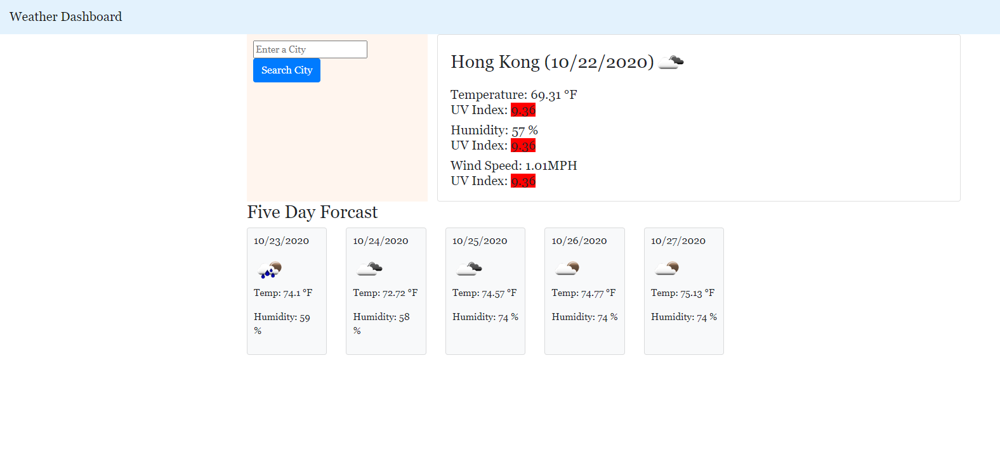
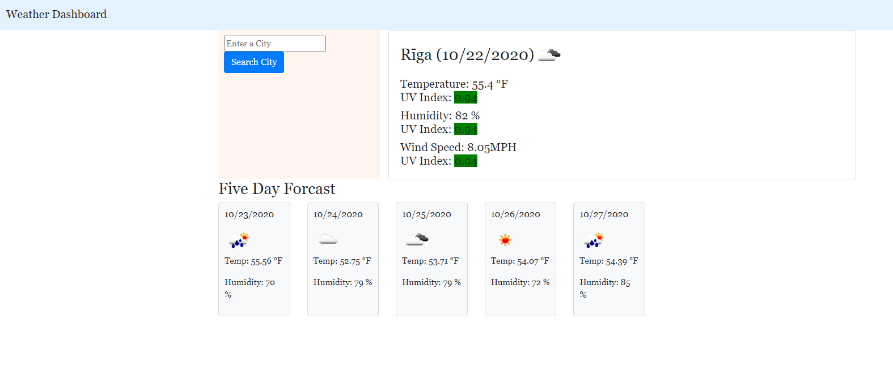

# 06-Weather-Dashboard

## Project Goal
As Developers we are often asked to retrivew data from APIs using it in the context of there own.
Third-party APIs allow developers to access their data and functions by making request with a presonal API key
and with a specific URL. Our challenge was to create a weather dashboard that will run in the browserand will 
feature dynamically updated HTML and CSS.

Using the openweather API we will retrive weather data for cities. In the documentation includes a section called "How to Start" this provides a basic setup and usage insructions for the developer. And we need to use local storage to store any presistent data.


## Link to my live Application
Here is a link to my live application.
 https://kobehill68.github.io/06-WeatherDashboard/


## User Story

```
AS A traveler
I WANT to see the weather outlook for multiple cities
SO THAT I can plan a trip accordingly
```


## Acceptance Criteria

```
GIVEN a weather dashboard with form inputs
WHEN I search for a city
THEN I am presented with current and future conditions for that city and that city is added to the search history
WHEN I view current weather conditions for that city
THEN I am presented with the city name, the date, an icon representation of weather conditions, the temperature, the humidity, the wind speed, and the UV index
WHEN I view the UV index
THEN I am presented with a color that indicates whether the conditions are favorable, moderate, or severe
WHEN I view future weather conditions for that city
THEN I am presented with a 5-day forecast that displays the date, an icon representation of weather conditions, the temperature, and the humidity
WHEN I click on a city in the search history
THEN I am again presented with current and future conditions for that city
WHEN I open the weather dashboard
THEN I am presented with the last searched city forecast
```

## Solution
All of my application has coded and preformed in JavaScript utilizing jQuery to work and manipulate the DOM.
The index.html uses a BootStrap contanier with two colums which sets up the page layout. The search history
is in col-3 and the main body of the page is in col-9.


### init()
This function is executed when the page loads.
It calls pullCityFromStore function.
If there are cities in storage then it will call: sCityWeather and sCityForecast functions.

### pullCityFromStore()
If there are cities in local storage they will be loaded into cityHist[].
loadLastCity flag is set to true.
Then it will call getCityHist().


### sCityWeather()
This builds a URL exclusive to the searched city.
Preforms a ajax call to the openweather endpoint.
Response items that are captured form the promise:
Name,Date,Icon,Humindity,Temp,Wind Speed,lat,lon.
Calls: getCityWeather(cName, cDate, cTemp, cHumid, cWindS, cIconUrl)
Calls: uvInd(cLat, cLon)


### uvInd()
This will recive lat and lon from sCityWeather
Then builds a url excluvise of lat and lon 
Preforms a ajax call to the openweathermap uv endpoint.
Calls the uvScale Function. 


### uvScale()
This will recive the UV index value from unInd and it will assign it to the local variable inVal.
Then it evaluates the value of indVAl and assigns a class or color of: Green,Yellow,Orange,Red
Defines a <span> having a atribute of the new defined class.
Defines an <h5> with UV Index: text, value, appends<span>.
Appends<h5>

### sCityForecast()
This builds a url excluesive to the searched city.
Preforms a ajax call to the openweather endpoint.
Response items that are captured form the promise:
Name,Date,Icon,Humindity,Temp,Wind Speed,lat,lon.
Calls: getCityForecast(forecasD, forecasTemp, forecasHum, forecastIUrl)


### getCityWeather()
This recives cName, cDate, cTemp, cHumid, cWindS, cIconUrl from sCityWeather.
It Utilizes jQuery to build a card deck putting it at the buttom of the page.


### getCityForecast()
This recives forecastD, forecastTemp, forecasrHumd, forecastIUrl from the sCitytForecast.
It Utilizes jQuery to build a card deck putting it at the top and right of the page.


### getCityHist()
This empties the #search-list parent so the updated list can be appened.
Creates a button for each city in history.
Prepend the new buttons to the #search-list.


### putCityToStore()
If a city is searched and is already in the history it will do nothing.
IF a new city is searched it will add it to the history.
Calls getCityHist.


## Live Application




## Sources
https://www.w3schools.com/
&
https://openweathermap.org/


